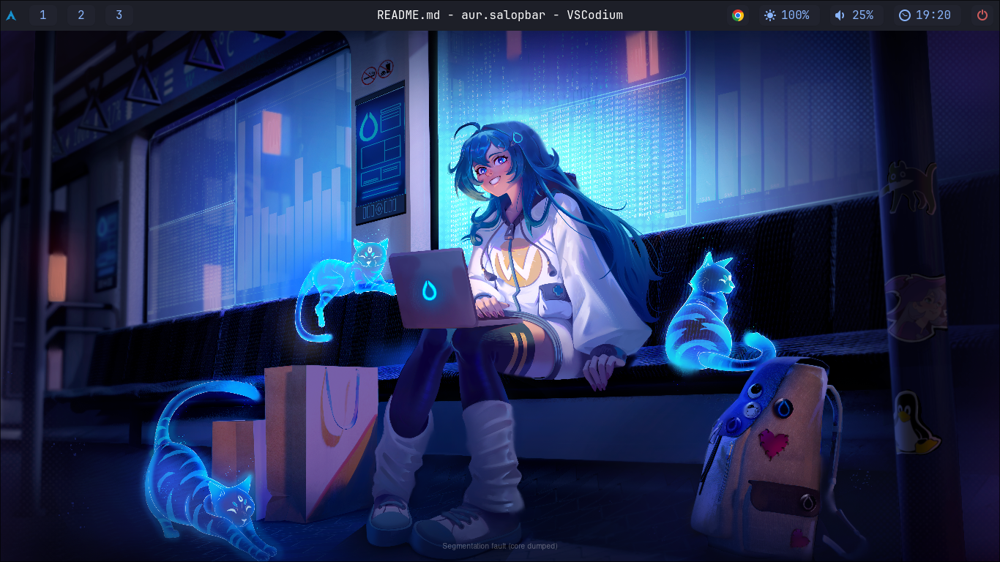

# Salop Bar

*Uma simples barra de status para Hyprland e Arch Linux, construída com AGS.*

---

## Sobre

**Salop Bar** é minha primeira experiência com GTK e Typescript para criar uma interface gráfica no Linux. À medida que minhas necessidades e estudos progridem, continuarei a aperfeiçoar este projeto.

Esta barra foi desenvolvida com [AGS (Aylur's Gtk Shell)](https://aylur.github.io/ags/), uma ferramenta que facilita a criação de widgets para o shell do GNOME usando TSX (uma sintaxe semelhante a JSX do React). O AGS utiliza GJS (Gnome JavaScript bindings) para fornecer acesso a bibliotecas do ecossistema GNOME.

## Tecnologias

*   **AGS**: Ferramenta CLI para desenvolvimento Desktop Shell em TSX;
*   **Ginm**: Biblioteca para GJS, que permite escrever widgets usando JSX;
*   **Astal**: Conjunto de bibliotecas para interação com audio, internet, bateria etc..;
*   **GObject**: Implementa um sistema orientado a objetos em C, é a base do GTK;
*   **GTK**: Biblioteca gráfica para criação de interfaces de usuário;
*   **GLib**: Bblioteca de utilitários de baixo nível;
*   **Gio**: Biblioteca para acesso a arquivos e I/O;
*   **TypeScript**: A linguagem de programação principal do projeto;
*   **Meson**: O sistema de build utilizado para compilação e instalação;
*   **GJS**: Tempo de execução do Javascript.

---

## 📦 Dependências

Para compilar e executar o Salop Bar, você precisará das seguintes dependências.

### Para Compilar (Build-time)

*   `meson`
*   `npm`
*   `esbuild`

### Para Executar (Runtime)

Necessárias para que o aplicativo funcione.

```bash
sudo pacman -S gjs gtk4 libadwaita gtk-layer-shell
```

*   **gjs**: O interpretador JavaScript do GNOME.
*   **gtk4**: A biblioteca de interface gráfica.
*   **libadwaita**: Contém widgets modernos do GNOME.
*   **gtk-layer-shell**: Permite que a barra se integre a shells Wayland.
*   **astal**: Um conjunto de bibliotecas para integração com o sistema. Você precisará instalar os pacotes `astal-4-4.0`, `astal-wireplumber-0.1`, `astal-network-0.1`, `astal-mpris-0.1`, `astal-hyprland-0.1`, `astal-notifd-0.1` e `astal-apps-0.1`. Verifique as instruções de instalação do [projeto Astal](https://aylur.github.io/astal/).

---

## 🚀 Começando

Siga os passos abaixo para clonar e configurar o ambiente de desenvolvimento.

```bash
git clone https://github.com/HelenoSalgado/salopbar.git
cd salopbar
npm install
```

---

## 🛠️ Comandos

### Testar

Para compilar o projeto e instalá-lo em um diretório local (`./dist`) para testes:

```bash
npm run build:test
./dist/bin/salopbar
```

### Desenvolver

Para rodar o projeto em modo de desenvolvimento com hot-reload:

```bash
npm run start:dev
```

### Instalar

Para instalar o `salopbar` no seu sistema:

```bash
npm run build:install
salopbar
```

---



## 📚 Referências

*   **AGS Docs**: <https://aylur.github.io/ags/>
*   **AGS README**: <https://aylur.github.io/README>
*   **Astal Docs**: <https://aylur.github.io/astal/>
*   **GJS Guide**: <https://gjs.guide/>
*   **GTK Docs**: <https://www.gtk.org/>
